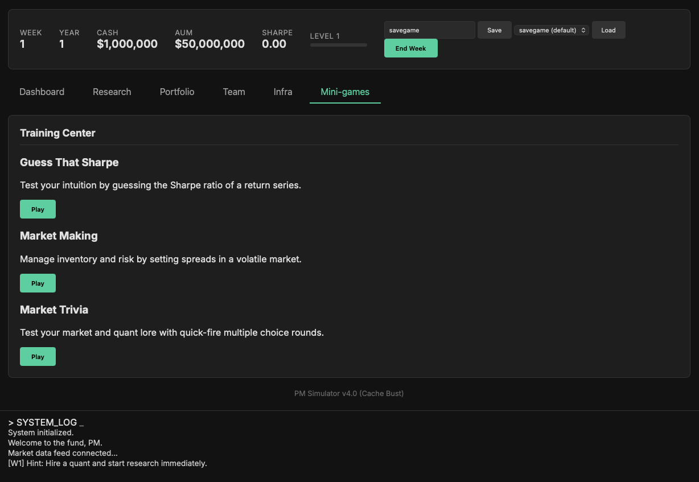
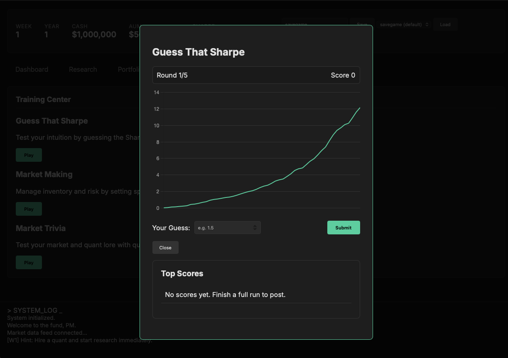

PM Simulator
============
Think you have what it takes to run a successful pod? Build and race a quant fund from a neon-lit command deck. Hire a team, ship research, rebalance, upgrade infra, and survive management while chasing XP.

Honestly, this all seems very tedious. Good luck!

Setup
-----
1) Install deps: `uv sync`  
2) Run: `uv run app.py`  
3) Open: http://localhost:5000

| View                  | Preview                                      |
|-----------------------|----------------------------------------------|
| Mini-games hub        |  |
| Guess That Sharpe HUD |  |

Goals & fail states
-------------------
- Grow AUM and XP by running profitable, resilient strategies.
- Avoid termination: job security falls on morale issues, governance events, deep drawdowns, or repeated losses.
- Win condition: AUM > $1B. Lose if job security hits 0 or AUM drops below floor.
- Safety valve: if drawdowns are brutal or capital shrinks to ~10% of start, a rival fund may offer a $50MM reboot; accept to reset PnL but expect much tougher alpha generation afterward.

Core loop (weekly)
------------------
- Process portfolio returns (regime-aware, alpha decay, market hedging if enabled).
- Startup grace: first few weeks are lighter on management scrutiny; after that, losses and drawdowns count fully.
- Pay weekly salaries; pay year-end bonuses (week 52) for happier quants.
- Advance research and risk-model projects; factor in team load/morale/infra for speed.
- Handle infra outages (mitigated by infra levels/reputation/resilience).
- Progress hiring pipeline; onboard completed hires; mentor quants.
- Apply morale impacts, management reactions to drawdowns/losses, and random events/requests.
- Log a story summary each turn (regime, resilience, PnL, payroll, morale, reputations).

Teams, hiring, mentoring
------------------------
- Quants: start a pipeline; higher-skill quants take longer to onboard; signing bonus is paid upfront.
- Infra specialists: hire via Infra tab; higher skill costs more and has longer onboarding. Management reputation speeds/slows onboarding.
- Pending hires join after their ETA; once active they draw weekly salary (quants) and boost infra (infra team).
- Mentoring: when morale is decent, quants can gain skill (and occasional morale) over time.
- Salaries paid weekly; year-end bonuses depend on happiness (better morale → higher bonus %).
- Management reputation influences hiring speed (both quants and infra).

Research, alphas, and decay
---------------------------
- Styles: Trend, Mean Reversion, Value (base 3/6/12 weeks).
- Speed: faster with more quants, higher data/compute, good morale; slower if overloaded or unhappy.
- Outcomes: research success probability uses infra, average skill, morale; rare breakthrough alphas (higher expected return, lower decay) more likely with strong/happy teams and good infra.
- Decay: alphas weaken over time; resilient alphas decay slower. Doing nothing means returns will fade.
- Portfolio: stored alphas go live when you assign weight; weights auto-normalize if >100%.
- Risk research: quants can also tackle risk-model projects to level up risk tools and unlock hedging benefits.

Risk model and hedging
----------------------
- Tracks rolling Sharpe, current/max drawdown, and regime (Trendy/MeanReverting/HighVol/LowVol).
- Researchable risk projects can level up risk tools.
- Market/factor neutrality: enabled by risk tooling/flags; reduces portfolio market hit in crashes.
- Management reacts to deep drawdowns and large weekly losses with reputation/job-security hits.

Infrastructure, resilience, infra team
--------------------------------------
- Infra levels: Compute, Data Quality, DevOps/Tooling, Risk Tools, Optimization.
- Infra team: specialists that reduce upgrade costs and raise resilience; keep them happy/skillful. Hiring takes time (faster if management reputation is high).
- Resilience score: higher infra + happy infra team + infra reputation lowers outage risk.
- Outages: random infra failures delay research; more likely if infra/reputation are weak.

Morale, reputations, events
---------------------------
- Morale: pay fairly and deliver wins to keep quants loyal; low morale triggers town halls, attrition, or revolts.
- Poaching: unhappy quants can be hired away by competitors, dragging down loyalty and happiness for those who remain.
- Reputations: tracked for quants, infra, management; fall with poor morale, outages, drawdowns, or losses; influence events and outage likelihood.
- Events: infra asks (approve/delay/reject upgrades), planning sessions, contentious town halls, management alarms on drawdowns/losses, market news.
- Firing: you can fire quants or infra; it hurts team morale and management reputation.

Finance
-------
- Weekly salaries (quants and infra); signing bonuses on hire.
- Year-end bonuses (week 52) scaled by happiness; only paid if yearly PnL is positive. Infra bonuses are smaller than quant bonuses.
- Story log surfaces payroll/bonuses every week.

Mini-games
----------
| Game              | Rounds | Reward path                                     |
|-------------------|--------|-------------------------------------------------|
| Guess That Sharpe | 5      | Guess Sharpe; leaderboard + XP on completion    |
| Market Making     | 10     | Standalone spread/inventory puzzle; XP by PnL   |
| Market Trivia     | 3      | Lore/strategy/math Q&A; XP if you score >0; bank in `minigames/trivia_bank.py` |

Saving/loading
--------------
- Name a slot in the header and Save (stores to `saves/<name>.json`, default `savegame`).
- Select a slot from the dropdown and Load to resume.

Extending
---------
- Trivia: edit `minigames/trivia_bank.py` entries (`prompt`, `options`, `answer` index).
- New mini-game: add under `minigames/`, wire `start_*`/`submit_*` in `game_engine.py`, routes in `app.py`, and UI/modal in `static/index.html` + handlers in `static/app.js`.
- Infra hiring UI: use the Infra tab form; backend action `hire_infra` and onboarding pipeline mirror quant hiring.
